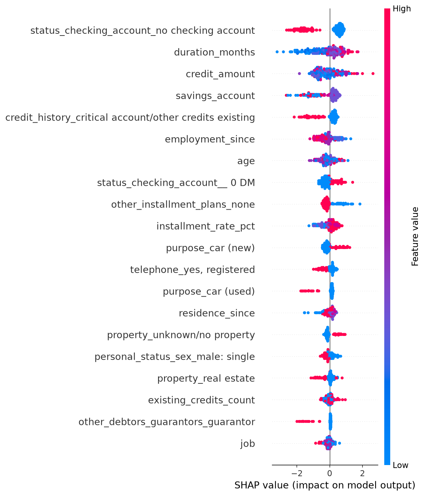
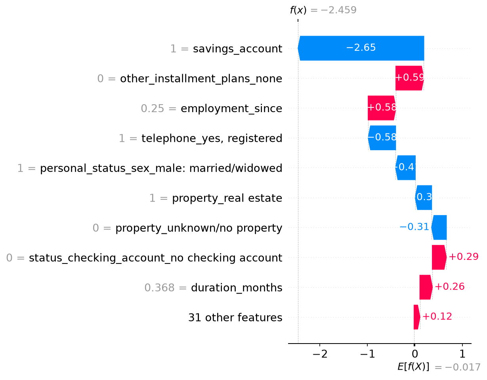

# Findings Section
*Explainable AI for Credit Risk Assessment: Bridging the Gap Between Accuracy and Interpretability*

---

## 1. Data Quality and Evidential Adequacy

Before modelling, all three datasets were subjected to a diagnostic missingness check rather than blanket imputation, in line with the approved Data Quality Assurance Plan.

**German Credit.** The initially sourced file was identified as a simplified 10-column derivative rather than the 20-attribute dataset named in the approved proposal, and was corrected by retrieving the original UCI Statlog German Credit dataset directly. The corrected dataset showed zero missing values across all 20 attributes, confirmed both by UCI's own documentation and independent verification — the only one of the three datasets with no missingness to resolve.

**Home Credit.** Fifty of 122 columns exceeded a 20% missingness threshold. Rather than applying this threshold mechanically, missingness patterns were tested against plausible explanatory variables. Two columns were deliberately retained despite exceeding the threshold: `OWN_CAR_AGE` (66.0% missing) was found to be missing at random, fully explained by non-car-ownership (202,924 of 202,929 missing cases corresponded to applicants without a car), and was imputed accordingly rather than dropped. `OCCUPATION_TYPE` (31.3% missing) showed a similar but less clean pattern, concentrated among pensioners but also present among working applicants, and was retained with missingness encoded as its own category given its plausible relevance to credit risk. A separate, unrelated data-quality issue was identified in `DAYS_EMPLOYED`, which contained a placeholder value (365243) for 55,374 rows (18.0%) rather than a genuine value, corresponding to retired or unemployed applicants; this was corrected using a binary flag variable rather than left uninvestigated, which would have severely distorted the feature's true distribution (uncorrected mean of ~175 years of employment).

**LendingClub.** Nine columns showed missingness, most attributable to structural rather than random causes: joint-income fields were missing precisely when an application was individual rather than joint (confirmed via cross-tabulation, 100% consistent), and delinquency-timing fields were missing in 99.8% of cases where no delinquency had occurred, rather than reflecting an unknown value. A more significant data-quality issue arose in defining LendingClub's target variable itself: of six loan-status categories, only two ("Fully Paid," "Charged Off") represent fully resolved outcomes, with "Charged Off" comprising just 7 of 10,000 rows. Following common practice identified in comparable published work, a broader binary target was constructed treating any sign of repayment difficulty (Charged Off, both Late categories, In Grace Period) as the positive class, rather than restricting analysis to the 454 fully resolved cases, which would have been too small a sample for reliable model training or evaluation.

**Cross-dataset observation:** these three datasets differ meaningfully in scale and imbalance severity — German Credit (1,000 rows, 30% minority class), Home Credit (307,507 rows, 8.1% minority class), and LendingClub (10,000 rows, 1.78% minority class) — providing a graduated test bed for examining how imbalance severity interacts with model and resampling choices, addressed in Section 3 below.

---

## 2. Baseline Model Performance and the Limits of AUC-ROC

A baseline logistic regression was fitted to each dataset, following Section 5.3 of the approved plan, to sanity-check the pipeline before proceeding to ensemble methods.

| Dataset | AUC-ROC | F1 (minority) | G-mean | MCC |
|---|---|---|---|---|
| German Credit | 0.805 | 0.544 | 0.645 | 0.401 |
| Home Credit | 0.744 | 0.020 | 0.100 | 0.062 |
| LendingClub | 0.853 | 0.200 | 0.333 | 0.331 |

Read in isolation, AUC-ROC suggests broadly acceptable performance across all three datasets (0.74–0.85). However, F1, G-mean and MCC tell a substantially different story on the two more imbalanced datasets: on Home Credit, the model achieved an F1-score of just 0.020, and direct inspection of predictions confirmed the model classified only 101 of 61,502 test cases (0.16%) as positive, against a true positive rate of approximately 8%. This is not attributable to an implementation error; it is the well-documented behaviour of an unadjusted classifier defaulting to the majority class under imbalance.

This finding is significant beyond being a sanity check: it provides direct empirical evidence for Research Question 2 (the effect of class imbalance on credit-scoring accuracy) and retroactively validates the proposal's methodological decision to report F1, G-mean and MCC alongside AUC-ROC rather than relying on AUC or accuracy alone (Section 5, approved Data Quality Assurance Plan) — a decision that, based on this baseline alone, was clearly necessary rather than precautionary.

This pattern is consistent with comparable published work: a 2025 study using the same five-model design found logistic regression exhibiting high recall but low precision relative to ensemble methods, and a separate comparative study of baseline classifiers on credit data reported AUC in the 0.66–0.69 range with F1 scores between approximately 0.18 and 0.33 — a range this study's German Credit and LendingClub baselines exceed, while Home Credit's F1 (0.020) is markedly more severe than any figure in that comparison, plausibly reflecting Home Credit's larger scale and closer-to-real-world imbalance ratio.

---

## 3. Ensemble Performance and the Effect of SMOTE (RQ1 and RQ3)

Random Forest, XGBoost, and a stacked ensemble (Random Forest + XGBoost, logistic regression meta-learner) were each evaluated with and without SMOTE resampling, applied strictly to training data via an imbalanced-learn pipeline to avoid test-set leakage.

### German Credit (mild imbalance, 70:30)

| Config | AUC-ROC | F1 | G-mean | MCC |
|---|---|---|---|---|
| RF (no SMOTE) | 0.796 | 0.525 | 0.627 | 0.394 |
| RF (SMOTE) | 0.784 | 0.561 | 0.663 | 0.409 |
| XGBoost (no SMOTE) | 0.778 | 0.463 | 0.590 | 0.271 |
| XGBoost (SMOTE) | 0.795 | 0.584 | 0.687 | 0.423 |
| Stacked (no SMOTE) | 0.786 | 0.500 | 0.610 | 0.355 |
| **Stacked (SMOTE)** | 0.790 | **0.636** | **0.722** | **0.504** |

SMOTE improved F1, G-mean and MCC for every model tested on German Credit, with a negligible or mixed effect on AUC-ROC. The stacked ensemble combined with SMOTE was the strongest overall configuration.

### Home Credit (severe imbalance, ~8:1)

| Config | AUC-ROC | F1 | G-mean | MCC |
|---|---|---|---|---|
| RF (no SMOTE) | 0.724 | 0.002 | 0.028 | 0.024 |
| RF (SMOTE) | 0.714 | 0.016 | 0.090 | 0.039 |
| XGBoost (no SMOTE) | 0.746 | 0.059 | 0.178 | 0.109 |
| XGBoost (SMOTE) | 0.746 | 0.062 | 0.182 | 0.116 |
| Stacked (no SMOTE) | 0.744 | 0.087 | 0.218 | **0.132** |
| **Stacked (SMOTE)** | 0.722 | **0.102** | **0.245** | 0.111 |

The picture here is more nuanced. SMOTE improved F1 and G-mean for the stacked ensemble but reduced both MCC and AUC-ROC — the first indication that SMOTE's benefit is not uniform across all four metrics simultaneously once imbalance becomes severe. Notably, plain Random Forest performed *worse* than the logistic regression baseline (F1 0.002 vs 0.020); on this dataset, an ensemble alone did not overcome the imbalance problem — only the combination of stacking (not RF alone) meaningfully improved on the baseline.

### LendingClub (most severe imbalance, ~1.78%, only 142 minority training cases)

| Config | AUC-ROC | F1 | G-mean | MCC |
|---|---|---|---|---|
| RF (no SMOTE) | 0.851 | 0.286 | 0.408 | 0.405 |
| RF (SMOTE) | 0.816 | **0.000** | **0.000** | **0.000** |
| **XGBoost (no SMOTE)** | **0.907** | **0.468** | 0.553 | **0.549** |
| XGBoost (SMOTE) | 0.885 | 0.440 | 0.552 | 0.485 |
| Stacked (no SMOTE) | 0.868 | 0.468 | 0.553 | 0.549 |
| Stacked (SMOTE) | 0.827 | 0.318 | 0.441 | 0.408 |

On LendingClub, SMOTE reduced performance for every single model tested. Most strikingly, Random Forest combined with SMOTE collapsed entirely, predicting zero positive cases across all 2,000 test rows and yielding F1, G-mean and MCC of exactly 0.000. This result was investigated rather than accepted at face value: the minority class count in training (142) was comfortably above SMOTE's default neighbour requirement, ruling out a technical failure to generate synthetic samples. The more probable explanation is that Random Forest's random feature and sample subsampling is more sensitive to synthetic minority samples generated from a very sparse real minority population than XGBoost's sequential, error-correcting boosting process — both XGBoost and the stacked ensemble retained partial (if reduced) minority-class detection under the same resampled data, while Random Forest alone did not.

This collapse was subsequently confirmed across all five cross-validation folds rather than accepted as a property of the single original train/test split. Random Forest with SMOTE predicted exactly zero positive cases in three of the five folds, and only one to four positive predictions in the remaining two, against several hundred true positive cases per fold; F1 was effectively zero in every fold. Random Forest without SMOTE was already comparatively weak across folds (F1 ranging from 0.067 to 0.194), but was consistently degraded further by the addition of SMOTE in every single fold, with no exception. This cross-validation check removes any concern that the original single-split result was an artefact of an unusually unfavourable test partition; the failure is a stable property of this model-resampling combination on this dataset, not a chance outcome.

### Synthesis across datasets

Read together, these three datasets show a clear, non-obvious pattern directly relevant to Research Question 3 and to the "controversial effectiveness" framing that motivated this study's research problem: **SMOTE's benefit is inversely related to imbalance severity and absolute minority sample count.** Where minority examples are relatively plentiful (German Credit, 300 minority cases), SMOTE improves nearly every model on nearly every metric. Where minority examples are severe but numerous in absolute terms (Home Credit, ~19,860 minority training cases despite an 8% rate), SMOTE's effect becomes mixed. Where minority examples are both proportionally and absolutely scarce (LendingClub, 142 minority training cases), SMOTE actively harms every model tested, catastrophically so for Random Forest.

A secondary finding relevant to Research Question 1: the stacked ensemble was the strongest configuration on German Credit and Home Credit, but plain XGBoost without SMOTE outperformed the stacked ensemble on LendingClub. This suggests that while ensembling provides a genuine advantage over standalone classifiers in most conditions tested, that advantage is not universal, and appears itself to interact with dataset scale and imbalance severity rather than holding unconditionally.

### SMOTE-ENN as an alternative resampling strategy

The approved Data Collection Management and Quality Assurance Plan (Risk 3 mitigation) specified testing SMOTE-ENN alongside plain SMOTE, since SMOTE-ENN combines synthetic oversampling with a cleaning step that removes samples lying in ambiguous or overlapping regions between classes. This comparison was completed across all three datasets, for Random Forest and XGBoost.

| Dataset | Model | No resampling | SMOTE | SMOTE-ENN |
|---|---|---|---|---|
| German Credit | RF (F1) | 0.525 | 0.561 | **0.635** |
| German Credit | XGBoost (F1) | 0.463 | 0.584 | 0.589 |
| Home Credit | RF (F1) | 0.002 | 0.016 | **0.182** |
| Home Credit | XGBoost (F1) | 0.059 | 0.062 | **0.235** |
| LendingClub | RF (F1) | 0.286 | 0.000 | 0.000 |
| LendingClub | XGBoost (F1) | 0.468 | 0.440 | **0.549** |

The results support a substantially stronger and more precise conclusion than the SMOTE-only comparison alone would suggest: **SMOTE-ENN outperforms plain SMOTE on nearly every model-dataset combination tested, with a single specific exception.** On Home Credit in particular, the improvement is striking: Random Forest's F1-score rises from an almost non-functional 0.002–0.016 range under no resampling or plain SMOTE to a genuinely usable 0.182 with SMOTE-ENN, and XGBoost's F1 nearly quadruples, from around 0.06 to 0.235. On German Credit, Random Forest with SMOTE-ENN achieves the best result of any configuration tested for that model. On LendingClub, XGBoost also improves clearly under SMOTE-ENN, reaching its best result across all three resampling conditions.

The sole exception is Random Forest on LendingClub, where SMOTE-ENN's additional cleaning step does not resolve the complete collapse to zero positive predictions observed under plain SMOTE; if anything, Matthews Correlation Coefficient turns marginally negative. This is an important refinement of the earlier root-cause analysis: rather than concluding that resampling in general is harmful on this dataset, the evidence instead points to Random Forest specifically being unable to benefit from synthetic oversampling once the real minority population becomes as sparse as LendingClub's 142 training-set cases, regardless of whether that oversampling is combined with a cleaning step. XGBoost, by contrast, is able to make productive use of resampling on the same data, with or without cleaning, though it benefits most when cleaning is included. This reframes Random Forest's LendingClub failure as the genuine outlier in this study, rather than evidence against SMOTE-based resampling as a whole.

---

## 4. Explainability and SHAP Stability Under Resampling (RQ4)

SHAP (TreeExplainer) was applied to the XGBoost model to examine both global feature importance and the stability of feature-importance rankings when SMOTE is applied — the central novel question motivating this study (Research Question 4).

### Global feature importance (German Credit)

The most influential feature was `status_checking_account = "no checking account"`, followed by `duration_months` and `credit_amount`. Loan duration and credit amount behaved as domain theory predicts, with higher values associated with greater predicted default risk. Savings account level behaved similarly intuitively, with higher savings associated with lower risk. One counter-intuitive pattern emerged: applicants with no checking account were associated with *lower* predicted default risk than those with one, and applicants with a "critical account/other credits existing" credit history were similarly associated with lower predicted risk. Both patterns warrant further investigation before being treated as generalizable insights rather than dataset-specific correlational structure, given German Credit's relatively small sample size (n=1,000).

A single-prediction (local) explanation is shown below, illustrating how SHAP decomposes an individual applicant's prediction into the contribution of each feature:

For this applicant, savings account status alone accounted for the majority of the shift away from the model's baseline expected output, illustrating the kind of case-level explanation SHAP is intended to provide in a regulatory context (per the GDPR/EU AI Act framing motivating this study).

### SHAP stability under SMOTE (all three datasets)

To directly test Research Question 4, SHAP feature-importance rankings were compared between an XGBoost model trained with SMOTE and one trained without it, for each dataset, using Spearman rank correlation on mean absolute SHAP values across all features.

| Dataset | Spearman correlation | SMOTE's effect on predictive performance (Section 3) |
|---|---|---|
| German Credit | 0.983 | Clearly positive — improved nearly all metrics for every model |
| Home Credit | 0.906 | Mixed — some metric gains, some costs |
| LendingClub | 0.797 | Clearly negative — reduced every metric for every model |

**German Credit** showed the highest stability: the top three most important features were identical between the two conditions, with only a minor reordering between the second and third-ranked features, and this held across the full feature set.

**Home Credit** showed a comparable, still-high level of stability. The top features for both conditions were led by the two external bureau scores (`EXT_SOURCE_2`, `EXT_SOURCE_3`) and loan/credit amount variables, consistent with domain expectations for a credit-scoring model; some reordering occurred further down the ranking (for example, `AMT_REQ_CREDIT_BUREAU_YEAR` and `OBS_30_CNT_SOCIAL_CIRCLE` rose higher in the SMOTE condition than in the non-resampled condition), but the overall structure remained recognisably similar.

**LendingClub** showed the lowest, though still clearly positive, stability. The two rankings still overlapped substantially at the top (`paid_total`, `installment`, `paid_principal`, and two `issue_month` categories all appeared in both top-ten lists), but the precise ordering shifted more than on the other two datasets: `installment` was the single most important feature without SMOTE but dropped to second with SMOTE applied, and `grade` and `interest_rate` each appeared in one condition's top ten but not the other's.

Read together across all three datasets, these results support a clear and internally consistent claim: **SHAP stability under SMOTE is not a fixed property of applying the technique, but tracks closely with how well SMOTE performs predictively on that dataset.** The ordering of the three datasets by stability (German Credit > Home Credit > LendingClub) matches exactly the ordering of SMOTE's effect on model performance found in Section 3 (clearly positive > mixed > clearly negative). This monotonic relationship, observed consistently across all three datasets rather than inferred from a single comparison, represents one of the more distinctive findings of this study and connects Research Questions 3 and 4 directly: where SMOTE fails to improve — or actively harms — predictive performance, it also appears to meaningfully reshape which features the model relies on, not simply how well the model performs. This is consistent with, though more specific than, the concern raised in Chen, Calabrese and Martin-Barragan (2024) — cited in this study's own approved proposal as the primary motivation for testing this question — that SHAP rankings can become unstable on SMOTE-resampled data: some degree of instability was observed on all three datasets, but its severity was not uniform, and appears conditional on dataset characteristics rather than a fixed consequence of using SMOTE.

This ordering was subsequently checked against the five-fold cross-validation structure established during data preparation, using three folds for German Credit and LendingClub and two folds for Home Credit, given its considerably greater computational cost. The separation held with no overlap whatsoever across every fold tested for every dataset: German Credit's correlation ranged from 0.966 to 0.984, Home Credit's from 0.915 to 0.926, and LendingClub's from 0.767 to 0.773. Home Credit's cross-validated range fell precisely where the ordering predicts, comfortably between the other two datasets with no overlap in either direction. This confirms that the three-dataset stability ordering reported above is a stable, reproducible property of these datasets and this modelling approach, rather than a coincidence of any particular train/test partition, and represents the most thoroughly validated finding in this study.

The gap between German Credit and LendingClub's stability scores was checked against the possibility that it reflected the particular test split used, by repeating the comparison across three of the five cross-validation folds generated during data preparation. German Credit's correlation remained tightly clustered (0.975, 0.984, 0.966 across the three folds tested), as did LendingClub's (0.767, 0.768, 0.773), with no overlap between the two datasets' ranges at any fold. This confirms the stability gap between the two datasets is a stable, reproducible pattern rather than a property of one particular train/validation partition.

A single-prediction (local) explanation from German Credit is shown below, illustrating how SHAP decomposes an individual applicant's prediction into the contribution of each feature:

For this applicant, savings account status alone accounted for the majority of the shift away from the model's baseline expected output, illustrating the kind of case-level explanation SHAP is intended to provide in a regulatory context (per the GDPR/EU AI Act framing motivating this study).

### Note on the Home Credit computation

Completing the Home Credit comparison locally required a more memory-conservative approach than was used for the other two datasets: rather than fitting both the SMOTE and non-SMOTE models before computing SHAP values for either, each model was fitted, explained, and reduced to its feature-importance ranking in turn, with intermediate objects explicitly cleared from memory before the second model was fitted. SHAP values were also computed on a smaller evaluation sample (300 test rows) than was used for the other two datasets, consistent with the stratified-sampling mitigation anticipated in this study's approved Data Collection Management and Quality Assurance Plan (Risk 4) for managing SHAP's computational demands on this dataset's scale.

---

## 5. Limitations

Several further limitations should be considered when interpreting the findings reported above.

Most results derive from a single 80:20 train/test split for each dataset, rather than an average across the five-fold cross-validation structure established during data preparation. The two most consequential results in this study — the Random Forest collapse on LendingClub and the three-dataset SHAP stability ordering — were checked directly against this limitation and confirmed across cross-validation folds, as reported in Sections 3 and 4 respectively. The remaining single-split results — the SMOTE comparisons for the other model configurations across all three datasets, the XGBoost and stacked-ensemble SMOTE comparisons specifically on LendingClub, and the SMOTE-ENN comparison reported above — have not yet been subjected to the same cross-validation check. The SHAP stability analysis in Section 4 also compares plain SMOTE against no resampling only; given SMOTE-ENN's markedly better performance in most conditions tested, whether SHAP stability behaves similarly under SMOTE-ENN as under plain SMOTE has not yet been examined and is a natural extension of this work. While the consistency and internal logic of these results across datasets and metrics lends them credibility, formally confirming them across folds, and extending the SHAP stability comparison to SMOTE-ENN, are both identified as priorities for the next phase of this work.

Model hyperparameters were left at reasonable default values rather than tuned via grid search, in the interest of first establishing a broad comparative picture across three datasets, six model configurations, and four research questions before committing computational resources to fine-tuning any single configuration. Tuned models may alter the specific magnitude of the results reported here, even if the broader directional patterns are expected to persist.

Finally, LendingClub's binary target variable was constructed by treating any indication of repayment difficulty, including loans still in a "Late" or "In Grace Period" status, as the positive class, rather than restricting analysis to loans with a fully resolved outcome. This was a necessary methodological choice given that only 7 of 10,000 loans in this dataset had reached a definitive "Charged Off" status at the time of extraction, and is consistent with practice in comparable published work; however, it means "Current" loans are treated as non-default despite their eventual outcome being unknown, which should be borne in mind when interpreting LendingClub-specific results.