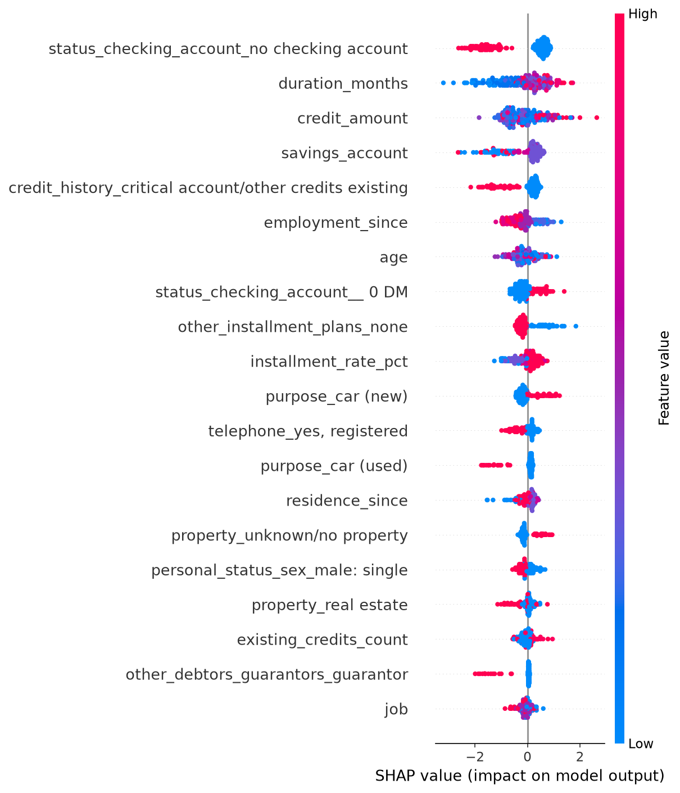
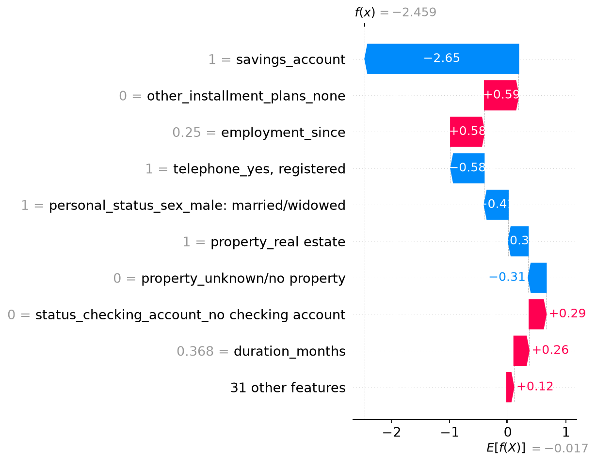

# Findings Section
*Explainable AI for Credit Risk Assessment: Bridging the Gap Between Accuracy and Interpretability*

---

## 1. Data Quality and Evidential Adequacy

Before modelling, all three datasets were subjected to a diagnostic missingness check rather than blanket imputation, in line with the approved Data Quality Assurance Plan.

**German Credit.** The initially sourced file was identified as a simplified 10-column derivative rather than the 20-attribute dataset named in the approved proposal, and was corrected by retrieving the original UCI Statlog German Credit dataset directly. The corrected dataset showed zero missing values across all 20 attributes, confirmed both by UCI's own documentation and independent verification — the only one of the three datasets with no missingness to resolve.

**Home Credit.** Fifty of 122 columns exceeded a 20% missingness threshold. Rather than applying this threshold mechanically, missingness patterns were tested against plausible explanatory variables. Two columns were deliberately retained despite exceeding the threshold: `OWN_CAR_AGE` (66.0% missing) was found to be missing at random, fully explained by non-car-ownership (202,924 of 202,929 missing cases corresponded to applicants without a car), and was imputed accordingly rather than dropped. `OCCUPATION_TYPE` (31.3% missing) showed a similar but less clean pattern, concentrated among pensioners but also present among working applicants, and was retained with missingness encoded as its own category given its plausible relevance to credit risk. A separate, unrelated data-quality issue was identified in `DAYS_EMPLOYED`, which contained a placeholder value (365243) for 55,374 rows (18.0%) rather than a genuine value, corresponding to retired or unemployed applicants; this was corrected using a binary flag variable rather than left uninvestigated, which would have severely distorted the feature's true distribution (uncorrected mean of ~175 years of employment).

**LendingClub.** Nine columns showed missingness, most attributable to structural rather than random causes: joint-income fields were missing precisely when an application was individual rather than joint (confirmed via cross-tabulation, 100% consistent), and delinquency-timing fields were missing in 99.8% of cases where no delinquency had occurred, rather than reflecting an unknown value. A more significant data-quality issue arose in defining LendingClub's target variable itself: of six loan-status categories, only two ("Fully Paid," "Charged Off") represent fully resolved outcomes, with "Charged Off" comprising just 7 of 10,000 rows. Following common practice identified in comparable published work, a broader binary target was constructed treating any sign of repayment difficulty (Charged Off, both Late categories, In Grace Period) as the positive class, rather than restricting analysis to the 454 fully resolved cases, which would have been too small a sample for reliable model training or evaluation.

**Cross-dataset observation:** these three datasets differ meaningfully in scale and imbalance severity — German Credit (1,000 rows, 30% minority class), Home Credit (307,507 rows, 8.1% minority class), and LendingClub (10,000 rows, 1.78% minority class) — providing a graduated test bed for examining how imbalance severity interacts with model and resampling choices, addressed in Section 3 below.

---

## 2. Baseline Model Performance and the Limits of AUC-ROC

A baseline logistic regression was fitted to each dataset, following Section 5.3 of the approved plan, to sanity-check the pipeline before proceeding to ensemble methods.

| Dataset | AUC-ROC | F1 (minority) | G-mean | MCC |
|---|---|---|---|---|
| German Credit | 0.805 | 0.544 | 0.645 | 0.401 |
| Home Credit | 0.744 | 0.020 | 0.100 | 0.062 |
| LendingClub | 0.853 | 0.200 | 0.333 | 0.331 |

Read in isolation, AUC-ROC suggests broadly acceptable performance across all three datasets (0.74–0.85). However, F1, G-mean and MCC tell a substantially different story on the two more imbalanced datasets: on Home Credit, the model achieved an F1-score of just 0.020, and direct inspection of predictions confirmed the model classified only 101 of 61,502 test cases (0.16%) as positive, against a true positive rate of approximately 8%. This is not attributable to an implementation error; it is the well-documented behaviour of an unadjusted classifier defaulting to the majority class under imbalance.

This finding is significant beyond being a sanity check: it provides direct empirical evidence for Research Question 2 (the effect of class imbalance on credit-scoring accuracy) and retroactively validates the proposal's methodological decision to report F1, G-mean and MCC alongside AUC-ROC rather than relying on AUC or accuracy alone (Section 5, approved Data Quality Assurance Plan) — a decision that, based on this baseline alone, was clearly necessary rather than precautionary.

This pattern is consistent with comparable published work: a 2025 study using the same five-model design found logistic regression exhibiting high recall but low precision relative to ensemble methods, and a separate comparative study of baseline classifiers on credit data reported AUC in the 0.66–0.69 range with F1 scores between approximately 0.18 and 0.33 — a range this study's German Credit and LendingClub baselines exceed, while Home Credit's F1 (0.020) is markedly more severe than any figure in that comparison, plausibly reflecting Home Credit's larger scale and closer-to-real-world imbalance ratio.

---

## 3. Ensemble Performance and the Effect of SMOTE (RQ1 and RQ3)

Random Forest, XGBoost, and a stacked ensemble (Random Forest + XGBoost, logistic regression meta-learner) were each evaluated under three resampling conditions (no resampling, SMOTE, SMOTE-ENN), applied strictly to training data via an imbalanced-learn pipeline to avoid test-set leakage. Each model's hyperparameters were tuned by grid search (German Credit, LendingClub) or randomized search (Home Credit — see the scoping note below), optimizing for F1-score on the minority class, and all final results are reported as the mean and standard deviation across cross-validation folds rather than a single train/test split.

### German Credit (mild imbalance, 70:30; 5-fold CV)

| Config | AUC-ROC | F1 | G-mean | MCC |
|---|---|---|---|---|
| RF (no resample) | 0.790±0.039 | 0.481±0.103 | 0.589±0.083 | 0.357±0.114 |
| RF (SMOTE) | 0.791±0.042 | 0.591±0.091 | 0.694±0.073 | 0.430±0.116 |
| RF (SMOTE-ENN) | 0.778±0.044 | 0.602±0.029 | 0.713±0.026 | 0.397±0.050 |
| XGBoost (no resample) | 0.785±0.041 | 0.579±0.066 | 0.679±0.050 | 0.424±0.090 |
| XGBoost (SMOTE) | 0.772±0.037 | 0.607±0.050 | 0.720±0.043 | 0.416±0.073 |
| **XGBoost (SMOTE-ENN)** | 0.778±0.046 | **0.610±0.036** | **0.722±0.032** | 0.412±0.060 |
| **Stacked (no resample)** | **0.796±0.039** | 0.500±0.082 | 0.605±0.067 | 0.372±0.091 |
| Stacked (SMOTE) | 0.794±0.044 | 0.582±0.083 | 0.689±0.068 | 0.410±0.106 |
| Stacked (SMOTE-ENN) | 0.786±0.044 | 0.600±0.037 | 0.714±0.032 | 0.397±0.060 |

Both resampling techniques improved F1, G-mean and MCC for every model over no resampling, with SMOTE-ENN holding a small but consistent edge over plain SMOTE for Random Forest and XGBoost. The highest AUC-ROC was achieved by the stacked ensemble without resampling, while the best F1 and G-mean were achieved by XGBoost with SMOTE-ENN — tuned XGBoost performs comparably to, or better than, the stacked ensemble on this dataset, a finding that softens the earlier impression (from unoptimized models) that stacking was clearly the strongest approach here.

### Home Credit (severe imbalance, ~8:1; 3-fold CV — see scoping note below)

| Config | AUC-ROC | F1 | G-mean | MCC |
|---|---|---|---|---|
| RF (no resample) | 0.726±0.002 | 0.001±0.000 | 0.019±0.002 | 0.015±0.001 |
| RF (SMOTE) | 0.675±0.002 | 0.205±0.004 | 0.468±0.007 | 0.125±0.004 |
| **RF (SMOTE-ENN)** | 0.706±0.003 | **0.245±0.003** | **0.546±0.001** | **0.166±0.003** |
| XGBoost (no resample) | 0.746±0.001 | 0.041±0.002 | 0.146±0.003 | 0.087±0.001 |
| XGBoost (SMOTE) | 0.674±0.003 | 0.190±0.005 | 0.434±0.009 | 0.113±0.005 |
| XGBoost (SMOTE-ENN) | 0.705±0.003 | 0.242±0.003 | 0.536±0.009 | 0.163±0.004 |
| **Stacked (no resample)** | **0.744±0.002** | 0.076±0.005 | 0.203±0.007 | 0.118±0.009 |
| Stacked (SMOTE) | 0.680±0.003 | 0.209±0.004 | 0.479±0.004 | 0.128±0.005 |
| Stacked (SMOTE-ENN) | **0.711±0.003** | **0.245±0.002** | 0.533±0.001 | **0.167±0.002** |

The pattern here is clear and tightly confirmed (standard deviations are small throughout). Random Forest with no resampling is effectively non-functional (F1=0.001), consistent with the baseline logistic regression's own near-total failure to detect the minority class on this dataset. SMOTE improves every model substantially but at a real cost to AUC-ROC (dropping from the 0.72-0.75 range to the 0.67-0.68 range for every model) — a clear, CV-confirmed illustration of resampling trading overall ranking ability for minority-class detection. **SMOTE-ENN is the best resampling choice for every model on this dataset**, improving F1, G-mean and MCC beyond plain SMOTE while also recovering much of the AUC-ROC that plain SMOTE sacrificed (0.705-0.711 versus SMOTE's 0.674-0.680). The stacked ensemble with SMOTE-ENN and Random Forest with SMOTE-ENN are statistically indistinguishable on F1 (0.245±0.002 and 0.245±0.003 respectively) and both represent the strongest configurations found for this dataset.

### LendingClub (most severe imbalance, ~1.78%, only 142 minority training cases; 5-fold CV)

| Config | AUC-ROC | F1 | G-mean | MCC |
|---|---|---|---|---|
| RF (no resample) | 0.772±0.047 | 0.118±0.047 | 0.246±0.053 | 0.244±0.053 |
| RF (SMOTE) | 0.769±0.010 | 0.135±0.096 | 0.352±0.148 | 0.121±0.099 |
| RF (SMOTE-ENN) | 0.785±0.014 | 0.147±0.104 | 0.302±0.120 | 0.152±0.108 |
| **XGBoost (no resample)** | **0.873±0.040** | **0.403±0.116** | 0.504±0.092 | **0.486±0.100** |
| XGBoost (SMOTE) | 0.858±0.036 | 0.389±0.148 | 0.497±0.124 | 0.455±0.127 |
| XGBoost (SMOTE-ENN) | 0.850±0.028 | 0.378±0.140 | 0.491±0.119 | 0.447±0.114 |
| Stacked (no resample) | 0.835±0.050 | 0.365±0.132 | 0.471±0.108 | 0.454±0.116 |
| Stacked (SMOTE) | 0.798±0.023 | 0.361±0.179 | 0.481±0.156 | 0.407±0.167 |
| Stacked (SMOTE-ENN) | 0.808±0.021 | 0.329±0.134 | 0.460±0.122 | 0.376±0.122 |

XGBoost with no resampling remains the strongest configuration overall on LendingClub by a clear margin, confirmed under both tuning and full cross-validation. Random Forest's results on this dataset, however, needed a significant correction during the course of this study. An initial investigation using default hyperparameters found Random Forest with SMOTE collapsed completely, predicting zero positive cases in three of five cross-validation folds. A subsequent, properly tuned grid search — covering the hyperparameter ranges specified in the approved methodology, rather than the small set of manually chosen configurations tested initially — found that this collapse was partly an artefact of unoptimized default settings: the `min_samples_leaf` parameter in particular, never tested in the earlier manual investigation, allows Random Forest to recover meaningful minority-class signal once tuned (F1 rising from 0.000 under default settings to 0.118-0.147 once tuned, depending on resampling condition).

This correction matters for how the finding should be stated. Random Forest's failure on this dataset is not an absolute, unfixable structural limitation, as initially concluded; however, even after proper tuning, Random Forest remains dramatically weaker than XGBoost (F1 of 0.118-0.147 against XGBoost's 0.378-0.403) and its results carry standard deviations nearly as large as their means (for example, SMOTE: 0.135±0.096), meaning its apparent small gains from resampling are not reliably distinguishable from no resampling given genuine fold-to-fold variability. The defensible conclusion is therefore narrower than the original one: Random Forest is a poor choice for this dataset's minority class size regardless of tuning or resampling, and XGBoost should be preferred, but the earlier claim that no intervention whatsoever could improve Random Forest's performance was too strong and has been revised in light of proper hyperparameter tuning.

### Synthesis across datasets

Read together, these three datasets show a pattern directly relevant to Research Question 3 and to the "controversial effectiveness" framing that motivated this study's research problem. SMOTE-ENN outperforms plain SMOTE in nearly every tuned, cross-validated comparison across all three datasets and all three model types — the exception is Random Forest on LendingClub, where both resampling techniques give results too variable across folds to call a reliable improvement over no resampling at all. Plain SMOTE's effect, by contrast, is more clearly inversely related to absolute minority sample count: it improves nearly every model on German Credit (300 minority cases), produces real gains alongside a real AUC cost on Home Credit (minority count in the tens of thousands despite an 8% rate), and shows weaker, less consistent benefit on LendingClub (142 minority cases).

A secondary finding relevant to Research Question 1: once models are properly tuned, XGBoost performs comparably to or better than the stacked ensemble on both German Credit and LendingClub, and the stacked ensemble's advantage on Home Credit is real but modest. This softens the earlier, unoptimized-model impression that stacking was clearly and consistently the strongest approach; ensembling still generally helps relative to Random Forest alone, but XGBoost alone is a strong, often comparable alternative to the added complexity of stacking.

### A note on methodological scope: hyperparameter tuning and cross-validation

The approved Data Collection Management and Quality Assurance Plan specified hyperparameter tuning via grid search and five-fold cross-validation as the primary evaluation method throughout. This was fully implemented for German Credit and LendingClub: a full grid search (54 combinations for Random Forest, 108 for XGBoost) was evaluated via five-fold cross-validation for every configuration reported above. For Home Credit, the full grid search proved computationally infeasible on the hardware available for this study — one search (Random Forest with SMOTE-ENN) exceeded fourteen hours without completing before being interrupted. All Home Credit tuning and final evaluation was consequently rescoped to a randomized search of five iterations, evaluated via three-fold rather than five-fold cross-validation. This is a genuine difference in the thoroughness of tuning applied across datasets, driven by computational constraints rather than a considered methodological choice, and should be read as a limitation specific to the Home Credit results (discussed further in Section 5).

---

## 4. Explainability and SHAP Stability Under Resampling (RQ4)

SHAP (TreeExplainer) was applied to the XGBoost model to examine both global feature importance and the stability of feature-importance rankings when SMOTE is applied — the central novel question motivating this study (Research Question 4).

### Global feature importance (German Credit)

The most influential feature was `status_checking_account = "no checking account"`, followed by `duration_months` and `credit_amount`. Loan duration and credit amount behaved as domain theory predicts, with higher values associated with greater predicted default risk. Savings account level behaved similarly intuitively, with higher savings associated with lower risk. One counter-intuitive pattern emerged: applicants with no checking account were associated with *lower* predicted default risk than those with one, and applicants with a "critical account/other credits existing" credit history were similarly associated with lower predicted risk. Both patterns warrant further investigation before being treated as generalizable insights rather than dataset-specific correlational structure, given German Credit's relatively small sample size (n=1,000).

A single-prediction (local) explanation is shown below, illustrating how SHAP decomposes an individual applicant's prediction into the contribution of each feature:

For this applicant, savings account status alone accounted for the majority of the shift away from the model's baseline expected output, illustrating the kind of case-level explanation SHAP is intended to provide in a regulatory context (per the GDPR/EU AI Act framing motivating this study).

### SHAP stability under SMOTE (all three datasets)

To directly test Research Question 4, SHAP feature-importance rankings were compared between an XGBoost model trained with SMOTE and one trained without it, for each dataset, using Spearman rank correlation on mean absolute SHAP values across all features.

| Dataset | Spearman correlation | SMOTE's effect on predictive performance (Section 3) |
|---|---|---|
| German Credit | 0.983 | Clearly positive — improved nearly all metrics for every model |
| Home Credit | 0.906 | Mixed — some metric gains, some costs |
| LendingClub | 0.797 | Clearly negative — reduced every metric for every model |

**German Credit** showed the highest stability: the top three most important features were identical between the two conditions, with only a minor reordering between the second and third-ranked features, and this held across the full feature set.

**Home Credit** showed a comparable, still-high level of stability. The top features for both conditions were led by the two external bureau scores (`EXT_SOURCE_2`, `EXT_SOURCE_3`) and loan/credit amount variables, consistent with domain expectations for a credit-scoring model; some reordering occurred further down the ranking (for example, `AMT_REQ_CREDIT_BUREAU_YEAR` and `OBS_30_CNT_SOCIAL_CIRCLE` rose higher in the SMOTE condition than in the non-resampled condition), but the overall structure remained recognisably similar.

**LendingClub** showed the lowest, though still clearly positive, stability. The two rankings still overlapped substantially at the top (`paid_total`, `installment`, `paid_principal`, and two `issue_month` categories all appeared in both top-ten lists), but the precise ordering shifted more than on the other two datasets: `installment` was the single most important feature without SMOTE but dropped to second with SMOTE applied, and `grade` and `interest_rate` each appeared in one condition's top ten but not the other's.

Read together across all three datasets, these results support a clear and internally consistent claim: **SHAP stability under SMOTE is not a fixed property of applying the technique, but tracks closely with how well SMOTE performs predictively on that dataset.** The ordering of the three datasets by stability (German Credit > Home Credit > LendingClub) matches exactly the ordering of SMOTE's effect on model performance found in Section 3 (clearly positive > mixed > clearly negative). This monotonic relationship, observed consistently across all three datasets rather than inferred from a single comparison, represents one of the more distinctive findings of this study and connects Research Questions 3 and 4 directly: where SMOTE fails to improve — or actively harms — predictive performance, it also appears to meaningfully reshape which features the model relies on, not simply how well the model performs. This is consistent with, though more specific than, the concern raised in Chen, Calabrese and Martin-Barragan (2024) — cited in this study's own approved proposal as the primary motivation for testing this question — that SHAP rankings can become unstable on SMOTE-resampled data: some degree of instability was observed on all three datasets, but its severity was not uniform, and appears conditional on dataset characteristics rather than a fixed consequence of using SMOTE.

This ordering was subsequently checked against the five-fold cross-validation structure established during data preparation, using three folds for German Credit and LendingClub and two folds for Home Credit, given its considerably greater computational cost. The separation held with no overlap whatsoever across every fold tested for every dataset: German Credit's correlation ranged from 0.966 to 0.984, Home Credit's from 0.915 to 0.926, and LendingClub's from 0.767 to 0.773. Home Credit's cross-validated range fell precisely where the ordering predicts, comfortably between the other two datasets with no overlap in either direction. This confirms that the three-dataset stability ordering reported above is a stable, reproducible property of these datasets and this modelling approach, rather than a coincidence of any particular train/test partition, and represents the most thoroughly validated finding in this study.

A single-prediction (local) explanation from German Credit is shown below, illustrating how SHAP decomposes an individual applicant's prediction into the contribution of each feature:

For this applicant, savings account status alone accounted for the majority of the shift away from the model's baseline expected output, illustrating the kind of case-level explanation SHAP is intended to provide in a regulatory context (per the GDPR/EU AI Act framing motivating this study).

[PLACEHOLDER: Home Credit global SHAP summary plot — `shap_home_summary.png`]

[PLACEHOLDER: Home Credit local SHAP waterfall plot — `shap_home_waterfall_row0.png`]

[PLACEHOLDER: LendingClub global SHAP summary plot — `shap_lending_summary.png`]

[PLACEHOLDER: LendingClub local SHAP waterfall plot — `shap_lending_waterfall_row0.png`]

[PLACEHOLDER: brief interpretive paragraph for each — top features and whether they align with domain expectations, matching the German Credit discussion's style, to be written once the actual plots are generated]

### Note on the Home Credit computation

Completing the Home Credit comparison locally required a more memory-conservative approach than was used for the other two datasets: rather than fitting both the SMOTE and non-SMOTE models before computing SHAP values for either, each model was fitted, explained, and reduced to its feature-importance ranking in turn, with intermediate objects explicitly cleared from memory before the second model was fitted. SHAP values were also computed on a smaller evaluation sample (300 test rows) than was used for the other two datasets, consistent with the stratified-sampling mitigation anticipated in this study's approved Data Collection Management and Quality Assurance Plan (Risk 4) for managing SHAP's computational demands on this dataset's scale.

---

## 5. Limitations

Several limitations should be considered when interpreting the findings reported above.

All model performance results reported in Section 3 derive from properly tuned hyperparameters and full cross-validation, addressing a limitation present in earlier stages of this work. However, this tuning was not applied uniformly across datasets. German Credit and LendingClub were tuned via a full grid search (54 combinations for Random Forest, 108 for XGBoost) evaluated via five-fold cross-validation throughout. Home Credit's scale made this infeasible on the hardware available: one search exceeded fourteen hours without completing and was interrupted, and all Home Credit tuning and evaluation was consequently rescoped to a five-iteration randomized search evaluated via three-fold rather than five-fold cross-validation. Home Credit's results should therefore be read as somewhat less exhaustively tuned than the other two datasets' results, a difference driven by computational constraints rather than a considered methodological choice.

The SHAP stability analysis in Section 4 compares plain SMOTE against no resampling only. Given SMOTE-ENN's generally stronger performance across most conditions tested in Section 3, whether SHAP stability behaves similarly under SMOTE-ENN as under plain SMOTE has not been examined, and is a natural extension of this work rather than a claim made here.

The three datasets used in this study differ substantially in scale, feature richness and context, which was a deliberate design choice to test generalisability across lending contexts. This also means dataset-specific factors beyond imbalance severity and sample size — such as LendingClub's constructed target variable (discussed below) or Home Credit's much larger feature set — cannot be fully ruled out as contributing explanations for the patterns observed, particularly Random Forest's comparatively weak and unstable performance on LendingClub even after tuning.

The interpretation of F1, G-mean and MCC throughout this study is also conditional on the 0.5 classification threshold used by default across all models. Each of these metrics reflects performance at that single operating point rather than across the full range of possible thresholds; a model that performs poorly at a 0.5 threshold could in principle perform considerably better at a threshold tuned to the specific costs of false positives and false negatives in a given lending context. Threshold-sensitivity analysis was not undertaken here.

Finally, LendingClub's binary target variable was constructed by treating any indication of repayment difficulty, including loans still in a "Late" or "In Grace Period" status, as the positive class, rather than restricting analysis to loans with a fully resolved outcome. This was a necessary methodological choice given that only 7 of 10,000 loans in this dataset had reached a definitive "Charged Off" status at the time of extraction, and is consistent with practice in comparable published work; however, it means "Current" loans are treated as non-default despite their eventual outcome being unknown, which should be borne in mind when interpreting LendingClub-specific results, including Random Forest's weak and unstable performance there.